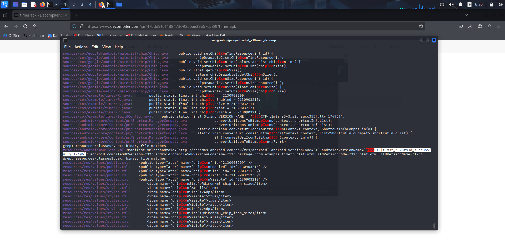

## Reto
### timer
## Descripcion
You will find the flag after analysing this apkDownload [here](https://artifacts.picoctf.net/c/449/timer.apk).
## Solucion
- cuando descargo el archivo veo que es un .apk
- empiezo a tener flashbacks de vietnam...digo, minions


- entonces empiezo a hacer lo mismo que en [M1n10n'5_53cr37](../Picomini2025/M1n10n'5_53cr37.md) 
- voy a [esta pagina](http://www.javadecompilers.com/apk) para descompilar el .apk
- descargo el archivo que me da en un zip
- descomprimo el zip y me da un buen de carpetas
- aplico este comando para buscar por algo en especifico en todas las carpetas
```
grep -RiE "pico"      
```
- encuentro la bandera busacando en los resultados: **picoCTF{t1m3r_r3v3rs3d_succ355fully_17496}**

## Notas
- a veces la IA aciera bastante bien en sus imagenes
- que haya sabido que hacer gracias a los minions, no significa que me alegre haber echo ese desafio >:v

## Referencias
[APK decompiler - decompile Android .apk ✓ ONLINE ✓](http://www.javadecompilers.com/apk)