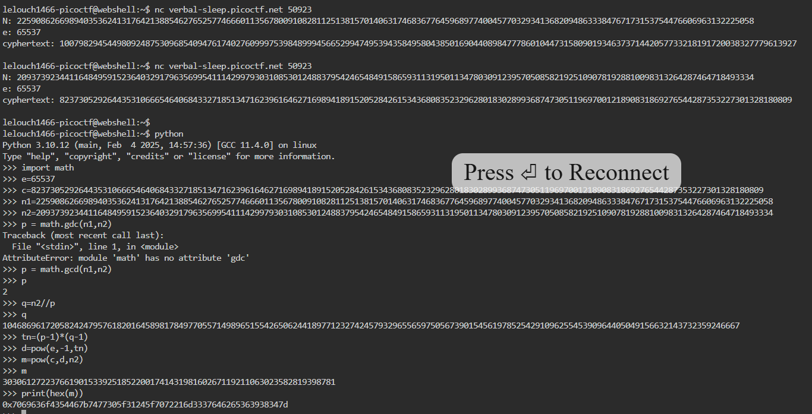

## Reto
EVEN RSA CAN BE BROKEN???
## Descripcion
This service provides you an encrypted flag. Can you decrypt it with just N & e?

Additional details will be available after launching your challenge instance.
## Solucion
- nos dan un netcat al cual conectarnos
- al conectarnos nos dan las variables para decifrar por RSA
- Nos dan "n, e, c" y nos piden resolver por m
- pero si volvemos a conectarnos los valores de c y n cambian
- pero esto es un problema ya que necesitamos d para resolver  y no tenemos los valores de p o q
```
Calculos
--------------------------------------------------
n  = p * q
tn = (p -1) * (q-1)
d = e ^ -1 (mod tn)	-> pow(e, -1, tn)

Decifrars
--------------------------------------------------
m = c ^ d (mod n)	python-> pow(c, d, n)
```
- viendo las pistas nos damos cuenta de que nos estan sugiriendo fuertemente que una de las variables primas (p y q) se estan reutilizando cada vez que el programa corre
```
How much do we trust randomness?
Notice anything interesting about N?
Try comparing N across multiple requests
```
- esto nos sirve porque:
1. sabemos que ambas variables (p y q) deben ser numeros primos(que solo son divisibles entre 1 y si mismos) 
2. si corremos el programa 2 veces tenemos 2 valores de n que se sacaron multiplicando 1 primo compartido entre ellos:
```
n1 = p * q1
n2 = p * q2
```
- como n es el producto de 2 primos , si tratamos de encontrar el **maximo comun divisor** entre ambas n, vamos a encontrar el valor de P, que en este caso fue 2
- con el valor de p decubierto podemos hacer la sustitucion para sacar q en cualquiera de los 2 valores de n
- con p y q sacamos tn
- y con tn podemos sacar d
- con e,c,d ya podemos sacar m, pasarlo a hex y ponerlo en cybershef para que nos de la bandera: **picoCTF{tw0_1$_pr!m37dbe6984}**

## Notas

## Referencias
[EVEN RSA CAN BE BROKEN??? (CTF Writeup) | by Ibnu Ilham | Medium](https://medium.com/@ibnuilham/even-rsa-can-be-broken-348c8455db50)