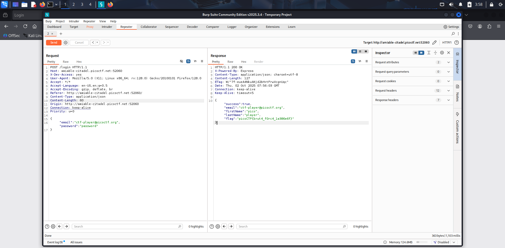

## Reto
Crack the Gate 1

## Descripcion
We’re in the middle of an investigation. One of our persons of interest, ctf player, is believed to be hiding sensitive data inside a restricted web portal. We’ve uncovered the email address he uses to log in: `ctf-player@picoctf.org`. Unfortunately, we don’t know the password, and the usual guessing techniques haven’t worked. But something feels off... it’s almost like the developer left a secret way in. Can you figure it out?

Additional details will be available after launching your challenge instance.

## Solucion
- al entrar a la pagina nos pregunta por un loggin 
- tenemos el usuario pero no la contraseña, si ponemos datos dummy no aparece nada interesante tampoco
- al revisar los elementos de la pagina vemos un comentario raro:
```
!-- ABGR: Wnpx - grzcbenel olcnff: hfr urnqre "K-Qri-Npprff: lrf" --
```
- parece un codigo raro, y por la pista nos dice que esta en ROT13, osea contar 13 letras despues en el alfabeto, numeros quedan igual
- al ponerlo en cybershef con da: 
```
NOTE: Jack - temporary bypass: use header "X-Dev-Access: yes"
```
- parece que jack dejo un backdoor modificando el header
- usando foxyproxy y burpsuite atrapamos esta conexion y la enviamos a repeater
- modificamos el header para agregar la linea: `X-Dev-Access: yes` y al enviarla la respuesta nos regresa la bandera:


## Notas

## Referencias
